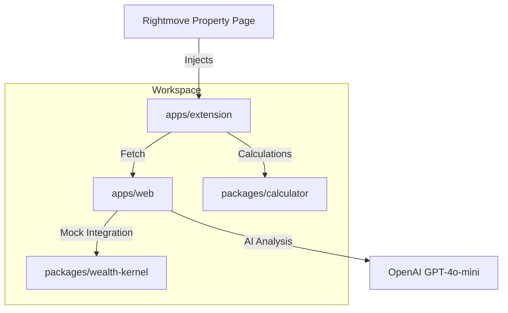

# GetGround Scout 🚀

GetGround Scout is a powerful browser extension and analysis tool designed to help property investors evaluate buy-to-let opportunities directly on Rightmove.

## 📺 Video Demo

[Watch the 2-minute walkthrough on Loom/YouTube](https://example.com/demo-video) (Placeholder)

---

## 🏗️ Architecture



### Components:
- **`apps/extension`**: Plasmo-based Chrome Extension injecting the Scout sidebar into Rightmove property pages.
- **`apps/web`**: Next.js 15 application hosting AI-powered extraction and analysis endpoints.
- **`packages/calculator`**: Shared logic for Buy-To-Let (BTL) and Section 24 tax comparisons.
- **`packages/wealth-kernel`**: Mock service reflecting WealthKernel's API for Money Market Fund yield projections.

---

## ✨ Features

- **AI Risk Dashboard**: One-click extraction of lease years, ground rent, and service charges with red-flag alerting (short leases, doubling ground rent clauses).
- **Section 24 Tax Comparator**: Compare personal vs. limited company tax liability based on investment parameters.
- **Dead Money Calculator**: Project lost interest during conveyancing using real-time Money Market Fund yields (5.1% mock).
- **Dynamic Sourcing**: Pre-filled GetGround onboarding links based on property data.

---

## 🚀 How to Run

### 1. Prerequisites
- [Node.js](https://nodejs.org/) (v18+)
- [pnpm](https://pnpm.io/)
- [OpenAI API Key](https://platform.openai.com/)

### 2. Installation
```bash
pnpm install
```

### 3. Environment Setup
Create `apps/web/.env.local`:
```env
OPENAI_API_KEY=your_key_here
```

### 4. Development
Start both the web API and the extension in development mode:

**Run Web API:**
```bash
cd apps/web
pnpm dev
```

**Run Extension:**
```bash
pnpm dev:extension
```
Then load the `apps/extension/build/chrome-mv3-dev` folder into Chrome as an unpacked extension.

---

## 🛠️ Tech Stack
- **Frameworks**: Next.js 15, Plasmo, TailwindCSS
- **AI**: Vercel AI SDK, OpenAI GPT-4o-mini
- **Language**: TypeScript
- **Package Manager**: pnpm (Workspaces)
